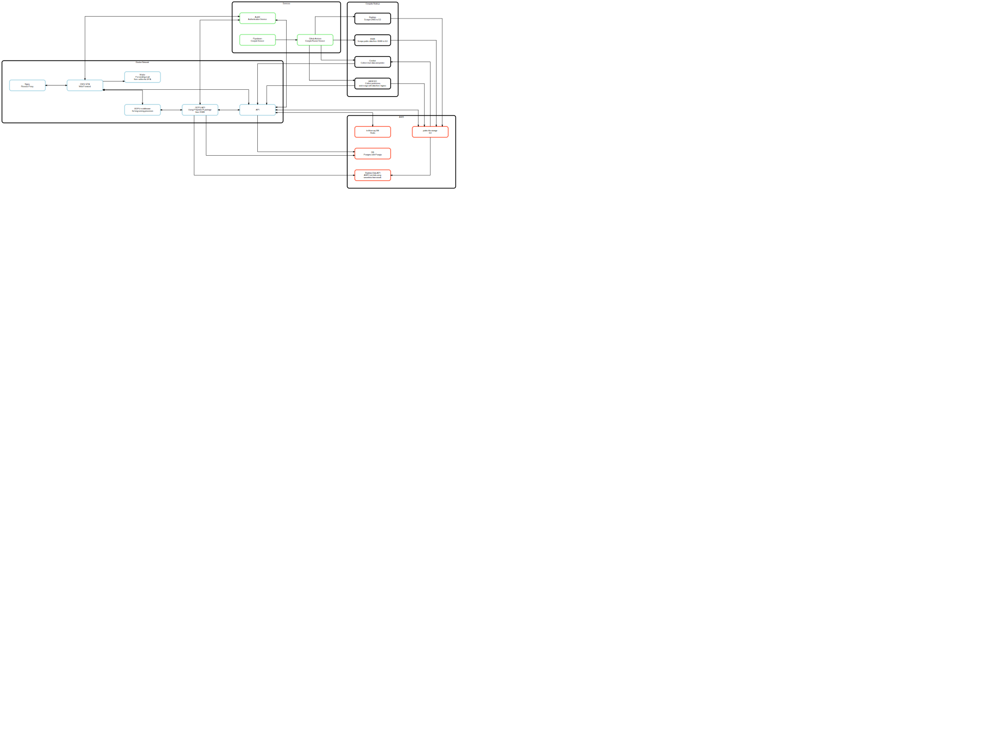

# Flusshygiene System Architecture

This is a graphviz flowchart of the all the components that make up the Flusshygiene project.

## Contributors

Thanks goes to these wonderful people ([emoji key](https://allcontributors.org/docs/en/emoji-key)):

<!-- ALL-CONTRIBUTORS-LIST:START - Do not remove or modify this section -->
<!-- prettier-ignore-start -->
<!-- markdownlint-disable -->
<table>
  <tr>
    <td align="center"><a href="https://fabianmoronzirfas.me/"> <b>Fabian Morón Zirfas</b></a> <a href="https://github.com/technologiestiftung/flusshygiene-system-architecture/commits?author=ff6347" title="Documentation">📖</a></td>
    <td align="center"><a href="https://vogelino.com/"> <b>Lucas Vogel</b></a> <a href="https://github.com/technologiestiftung/flusshygiene-system-architecture/commits?author=vogelino" title="Documentation">📖</a></td>
  </tr>
</table>

<!-- markdownlint-restore -->
<!-- prettier-ignore-end -->

<!-- ALL-CONTRIBUTORS-LIST:END -->

This project follows the [all-contributors](https://github.com/all-contributors/all-contributors) specification. Contributions of any kind welcome!

## Credits

### Partners network

<table>
  <tr>
    <td>
      
    </td>
    <td>
      
    </td>
    <td>
      
    </td>
    <td>
      
    </td>
  </tr>
</table>

### Developed in the project

<table>
  <tr>
    <td>
      
    </td>
</table>

### Supported by

<table>
  <tr>
    <td>
      
    </td>
    <td>
      
    </td>
  </tr>
</table>
